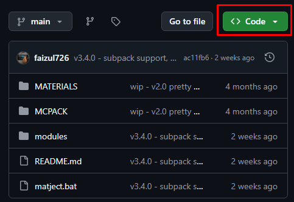
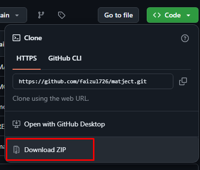

# Downloading from GitHub

1. Go to [Matject GitHub repo](https://github.com/faizul726/matject)     

2. Click green code button.  
\


<br>

3. Click Download ZIP  
\
  
 Pro tip: You can also use this (if you know what it means),
```sh
git clone https://github.com/faizul726/matject.git && cd matject
```
<br>

**[Next steps...](/docs/first-setup)**