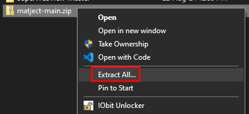
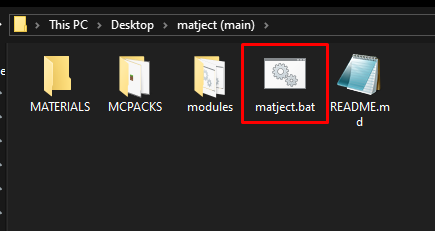
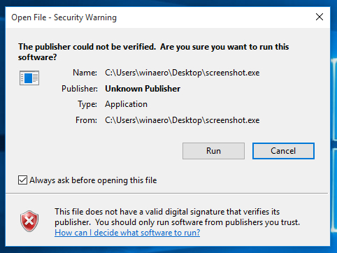
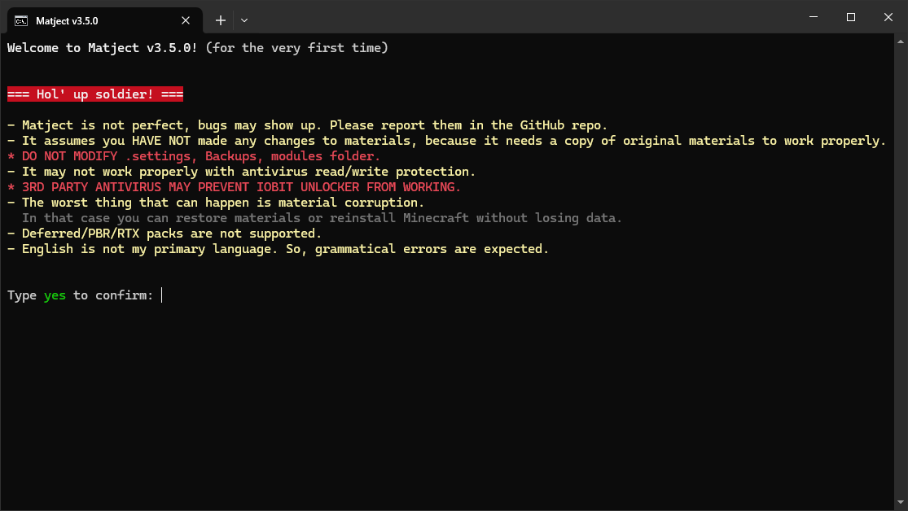

# First setup

1. Once the download is finished, extract the ZIP file  

> *don't tell me you don't know how to extract a ZIP file* 

 

2. Open the folder where you extracted, then go to `matject-main`

3. Open `matject` file  

 

If something like this shows up, click `Run` and optionally turn off "Always ask before opening this file" to avoid annoyance.  

  

4. A screen like this should show up  

  

5. "Read" ~~(Hint: Write yes and enter)~~ 

6. Use "common sense"   
Because depending on the situation it may not be the same always. So, a fixed guide won't help here.

::: tip
You have to navigate using keyboard buttons.  
All actions are labelled with the key to press.  

&nbsp;

You have to "click" for a short time (same as how you press `ENTER`)  
But don't "hold".  
Holding may cause it to do something unintended.
:::

  
You're on your own now 