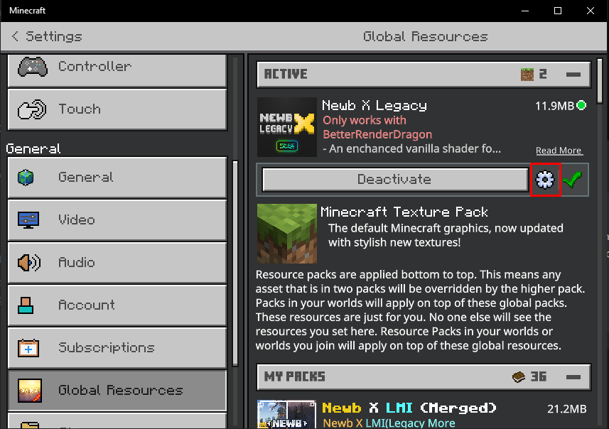
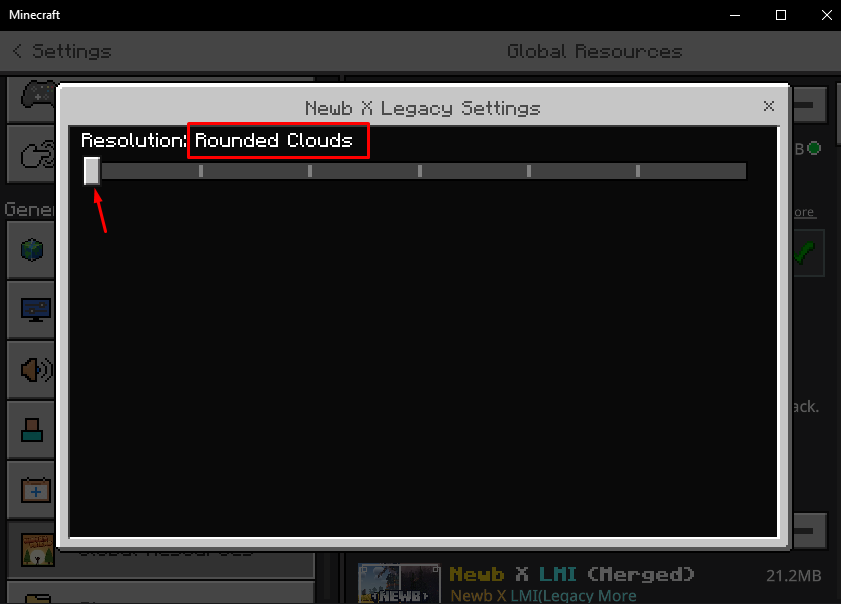
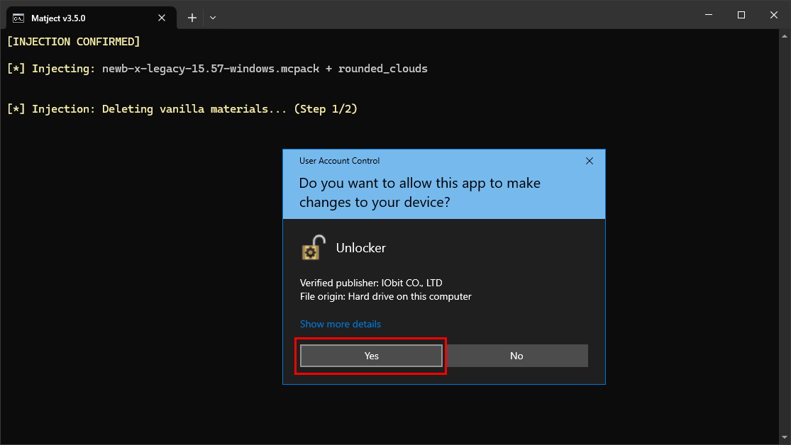

# Guide for beginners  

Hello there!   
I know why you're here. So, let's get straight to the subject!  

::: tip Things you need to know!
* Matject is a script to make using shaders on Minecraft: Bedrock Edition much easier.
* Matject ≠ Patched.
* **Absolutely zero** Command Prompt/Terminal knowledge is needed to use it!  
All you have to do is press some keys to navigate.  
* It automatically takes care of many things.  
So, don't worry; just give it the shader you want to use, and it will work.
* It's 100% safe.  
* If you need help you can ask me in #newb-support of [Newb Discord Server](https://faizul726.github.io/newb-discord)
> You can know more about Matject on this documentation. Just explore!
:::

  

# So, what should I do now?
**Check requirements**  
* Install **[IObit Unlocker](https://www.iobit.com/en/iobit-unlocker.php)**
* Make sure you haven't modified Minecraft `material.bin` files before.  
If you don't know what it means, then most probably you haven't modified anything. So, don't worry.
* Make sure you have **PowerShell** on your PC. (Most Windows PCs have PowerShell built in)
::: details How to check if you have PowerShell?
By searching `powershell` in the start menu.  

  

::: details What if I don't have it?
Check this [guide](https://www.makeuseof.com/windows-cannot-find-powershell-fix/) to get PowerShell on your PC.
:::
* Know basic English

 
 

## Download and setup
1. Get Matject from [here](https://github.com/faizul726/matject/archive/refs/heads/main.zip) if you haven't already.  

2. Now, you should have a file named `matject-main.zip`. Extract it.  

 

  

3. Go to the extracted folder named `matject-main` and open `matject`  

  

  

>   
> If something like this shows up, click `Run` (Tip: Turn off "Always ask before opening this file" to avoid annoyance)

  

4. A window like this should show up,  

  

Read it properly, write `yes` and press ENTER.  

  

5. (see below)

> 
> 
>   
> &nbsp;
> These are optional. You can press [Y] for Yes or [N] for No to confirm your decision.  

  

6. If you are asked to unlock WindowsApps like this...  

  

Press [Y] to unlock the WindowsApps folder. It will allow Matject to see content inside so that it can make backup.  

**Don't worry.** The folder doesn't contain any private information.  

  

7. Now if everything is okay, it will make a backup and bring you to a window like this,  

 

  

## Applying a shader  

**Congratulations on making it this far!**  

Now, let me show you how to apply a shader...  

 

1. In the main screen, press [1] to use the Auto method  

  

  

2. Put the shader MCPACK or ZIP file in the `MCPACKS` folder  

  

::: details Can I put multiple MCPACK or ZIP files in the `MCPACKS` folder?  
Yes, you can put all your favorite shaders in the folder.  

For multiple files, a list like this will show up,  

  
> You can write the number of the shader that you want to use and press ENTER.  
> Here, I wrote 3, and pressing enter will pick the 3rd shader from the list named MLYX...
:::

  

3. Confirm your selection by pressing [Y] or [N]  

  

  

4. If asked to choose a subpack, write its number and press ENTER.  

  
> Here, I wrote 6, and pressing enter will pick the 6th subpack from the list named rounded_clouds  

::: details What is subpack?  
It's like settings for the shader. Many shaders come with options like these.  

::: details Keep in mind...
You also have to select the same subpack from resource pack settings later to make sure the shader works as expected.  
The names shown in the list and in resource pack settings may not always be the same. In that case, you can check manifest.json inside the provided file to get an idea of what each in the list does.  

  
  

&nbsp;

You can also write `/skip` and press **[ENTER]**. and it will skip the subpack part.  
(only if you know what you're doing + it may cause the shader to not work as expected.)
:::

  

5. If everything was okay, a window like this will show up,  

  

> Here, you can press [Y] or [N] to confirm injection (applying shader to Minecraft).  

  

6. Accept all admin permission requests.  

  
Based on the situation, it will ask you 2 or 4 times.  

    

## Congratulations!  

</img>

**You have applied a shader successfully.**  

  

It's better to import the MCPACK and activate it if asked to do so.  

 

  
If you selected a subpack, make sure to activate the same subpack in the settings (gear icon) of your shader in global resource packs.  

 

## 🔄 You may want to see [How to remove/uninstall shaders?](/docs/restoring-to-default)

  

## Screenshots

.png>)  
  
.png>)  

 

::: tip
If you're changing shaders, you don't have to restore manually.  
It will automatically restore files as needed.
:::  