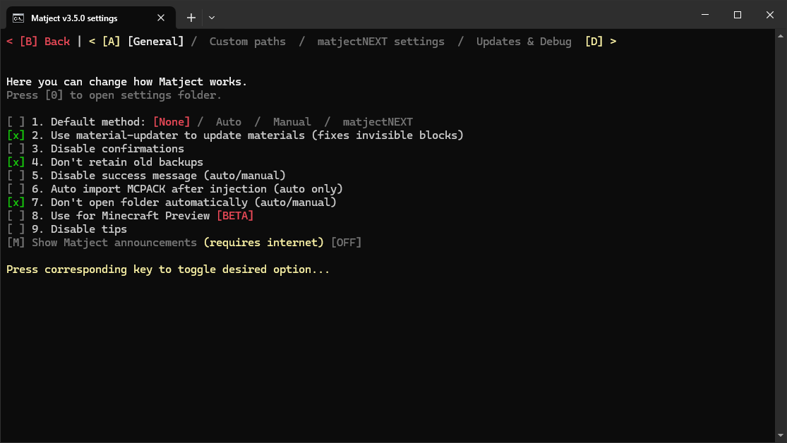

# Matject settings explained

Matject has many options in settings to greatly enhance user experience.  

Here, I explained every settings (as of v3.5.0)  

[General](#general)  
[Custom paths](#custom-paths)  
[matjectNEXT settings](#matjectnext-settings)  
[Updates & Debug](#updates-debug)  

 

::: details How to open settings and navigate...
To open Matject settings press **[S]** in the main screen.  

  

  

  

Press **[A]** or **[D]** to switch tab (go left or right)  
All options are labelled with the key to press.    
:::

  

## General
Pressing **[0]** will open `.settings` folder where Matject stores its configurations and other data.  

---

**Default Method:**  
Sets the method to automatically open when Matject is started.  
Press [1] to switch between options.  

---

**Use material-updater to update materials:**  
Enables material-updater. [[?]](/docs/what-is-material-updater)  
Usually fixes invisible block and other version specific issues.  

---

**Disable confirmations:**  
Disables confirmations in file selection, injection and some more...

---

**Don't retain old backups:**  
Deletes old backup automatically when making backup of new Minecraft version files.

---

**Disable success message:**  
Disables the success/thank you message of auto and manual method.

---

**Auto import MCPACK after injection:**  
For auto method only.  
Opens provided MCPACK/ZIP file with associated app.  

---

**Don't open folder automatically:**  
Disables auto folder opening for auto and manual method.  
For those who add files before opening Matject.

---

**Use for Minecraft Preview:**  
Makes Matject use Minecraft Preview instead.  
Some settings are kept separate for it. So, you can use it for any Minecraft at any time.

---

**Disable tips:**  
Disables helpful tips everywhere.  
For those who are experienced enough 

---

**Show Matject announcements:**  
Shows 1 line announcements in the main screen.  
For those who want to stay up to date about Matject.

---

  

## Custom paths
**Use custom Minecraft app path:**  
Sets path of Minecraft app automatically using PowerShell Get-AppxPackage command or by taking manual input from user.  
Recommended for 3rd party Minecraft launcher users.  
Enabling this prevents calling PowerShell at startup. Thus greatly improving startup speed on some PCs.

---

**Use custom Minecraft data path:**  
Sets path of Minecraft data folder.  
Recommended for 3rd party Minecraft launcher users.  
For those who wants to work with different data folder.  

By default it is: `"%LOCALAPPDATA%\Packages\Microsoft.MinecraftUWP_8wekyb3d8bbwe\LocalState\games\com.mojang"`

---

**Use custom IObit Unlocker path:**  
Sets path of IObit Unlocker folder location.  
For those who wants to use IObit Unlocker from a different location.

---

  

## matjectNEXT settings
Some settings dedicated for matjectNEXT only.  

**Just sync and exit:**  
Exits from matjectNEXT after sync is complete.

---

**Disable manifest checker:**  
Disables manifest checking.  
Not recommended to enable.  

This prevents you from finding out which resource pack has invalid `manifest.json`.

---

  

## Updates & Debug
**Check for updates at Matject startup:**  
Checks for Matject updates when Matject is opened.

---

**Disable interruption check:**  
Disables power loss/interruption check.  
Not recommended to enable.  

Enabling this will skip the message that asks you to perform a full restore at Matject startup.

---

**Disable material compatibility check:**  
Disables checking `.material.bin` files.  
Not recommended to enable.  

Enabling this will allow injecting shaders that are not made for Windows.  

---

**Run IObit Unlocker as admin:**  
Reduces admin permission requests to only 1.  
Experimental. Only works with auto and manual method for now.  

For those who find accepting IObit Unlocker admin permission requests annoying.  
Also automatically closes IObit Unlocker messages.

---

**Check for updates manually:**  
Checks for Matject updates.  

---

**DEBUG MODE:**  
Enables "Restore & Others -> Drop to shell", matjectNEXT cache logging, detailed information about injections.  

Intended for testing/debugging purpose.

---

**Run Matject as admin always**  
Runs Matject as administrator.  
Effectively skipping every admin permission requests.  

Selecting PowerShell will launch Matject using Start-Process command combined with -Verb runAs  

Selecting VBscript will create a helper script in `.settings\runAsAdmin.vbs` with a fixed path to `matject.bat` or `Matject.lnk` if user has made shortcut.