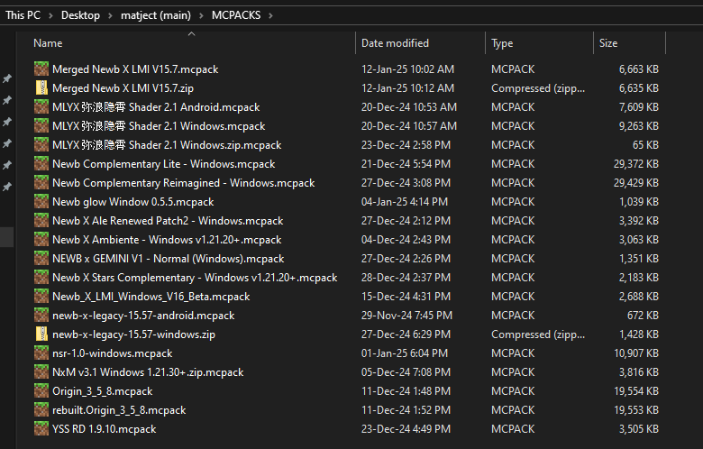
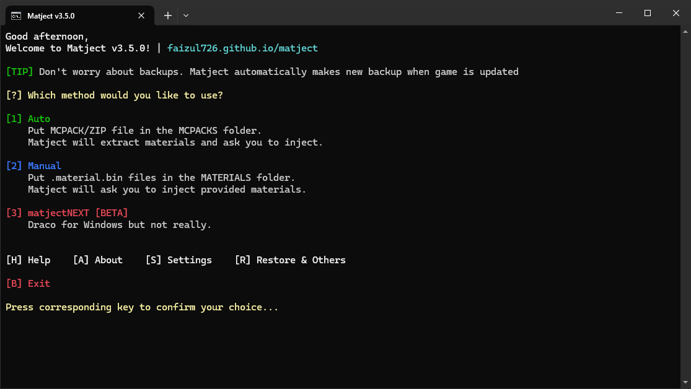

# How to use auto method?

::: warning Conditions
The shader you want to use must meet some conditions.  

* It must be specifically for Windows. (**merged** should also work if you know what I mean)
* Should support your Minecraft version. Or you will see invisible blocks or game might crash. (can be fixed using [material-updater](/docs/what-is-material-updater))
* If it requires a resource pack, you should import and activate it.  
:::

 

With that being said, let's get started...  

1. Get the MCPACK/ZIP file that you want to use. (no need to extract)  

2. Put it in the `MCPACKS` folder.  

  

3. Open `matject`.  

  

  

4. In the main screen, press **[1]** for "Auto method".  

  

  

5. By default, it will open up the `MCPACKS` folder for you to put the file in there.  
If you did "step 2" then simply close the window and press any key to continue.  

::: tip Tip
You can disable auto folder opening from settings.
:::

::: details Note about multiple MCPACK/ZIPs in the `MCPACKS` folder...
If it finds multiple MCPACK/ZIPs in the `MCPACKS` folder it will show you a list where you can select any one by entering its number.  

  

For example: If you write `13` and press **[ENTER]** it will pick the 13th item from the list.  
In this case, it will pick "newb-x-legacy-15.57-windows.mcpack"
:::

  

6. Confirm your choice by pressing **[Y]** for yes and **[N]** for no.  

  

::: details Note about subpacks...
If chosen file has subpacks it will show you a list where you can select any one by entering its number.  

  

For example: If you write `6` and press **[ENTER]** it will pick the 6th item from the list.  
In this case, it will pick "rounded_clouds"  

::: info Keep in mind
You also have to select the same subpack from resource packs settings later to make sure the shader works as expected.  
The names shown in the list and in resource packs settings may not be the same always. In that case, you can check manifest.json inside the provided file to get an idea of what each in the list do.  

  
  

&nbsp;

You can also write `/skip` and press **[ENTER]** and it will skip the subpack part  
(only if you know what you're doing + it may cause shader to not work as expected.)
:::

  

7. If everything went good, it should show a list files that it is going to replace like this...  

  

Here, you can press, 

**[Y]** to confirm replacement/injection  

**[R]** to refresh the file list  
::: info Info
Use this if you want to include other `.material.bin` files in the `MATERIALS` as well.  
After adding files, pressing **[R]** should show new files in the list.
:::  

**[N]** to cancel.  
It will return to the main screen.  

  

8. Accept admin permission requests.  

  

Based on the situation, it will ask you 2 or 4 times. You have to accept all.  

  

## Congratulations!  
**You have applied a shader succesfully.**  

It's better to import the MCPACK and activate it if asked to do so.  

  

  

::: tip
If you're changing shaders, you don't have to restore manually.  
It will automatically restore files as needed.
:::