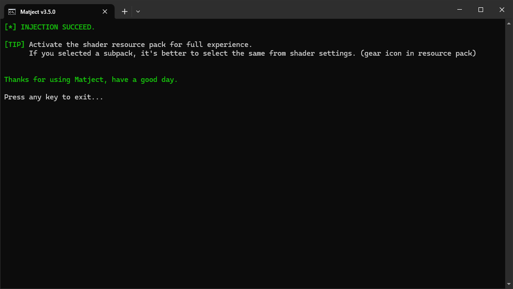

# How to use manual method?

::: warning Conditions
The materials you want to use must meet some conditions.  

* Those must be specifically for Windows. (**merged** should also work if you know what I mean)
* Should support your Minecraft version. Or you will see invisible blocks or game might crash. (can be fixed using [material-updater](/docs/what-is-material-updater))
* If it requires a resource pack, you should import and activate it.  

&nbsp;

"**You**" should also... 
* Have understanding of basic English. 
* Be able to "read".
* Have common sense.
* Know that, "Command Prompt/Terminal ≠ Virus"
:::

 

With that being said, let's get started... 

1. Get the `*.material.bin` files you want to use.  

2. Put them in the `MATERIALS` folder.  

  

  

3. Open `matject`.  

4. In the main screen, press **[2]** for "Manual method".  

  

  

5. By default, it will open up the `MATERIALS` folder for you to put files in there.  
If you did "step 2" then simply close the window and press any key to continue. 

::: tip Tip
You can disable auto folder opening from settings.
:::

  

6. If everything went good, it should show a list files that it is going to replace like this...  

  

Here, you can press, 

**[Y]** to confirm replacement/injection  

**[R]** to refresh the file list  
::: info Info
Use this if you want to include other `.material.bin` files in the `MATERIALS` as well.  
After adding files, pressing **[R]** should show new files in the list.
:::  

**[N]** to cancel.  
It will return to the main screen.  

7. Accept admin permission requests.  

  

Based on the situation, it will ask you 2 or 4 times. You have to accept all.  

  

**Congratulations! You have applied a shader succesfully.**  

If there is a MCPACK for the materials it's better to import and activate it.  

  

::: tip
If you're changing shaders, you don't have to restore manually.  
It will automatically restore files as needed.
:::