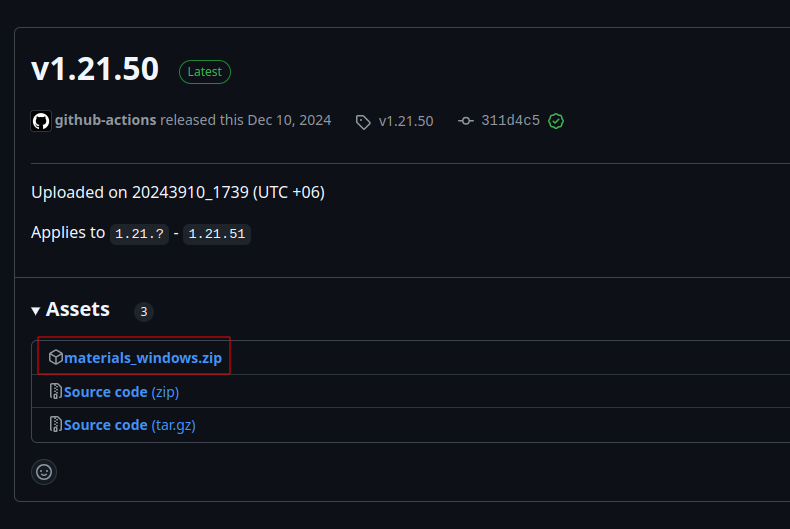
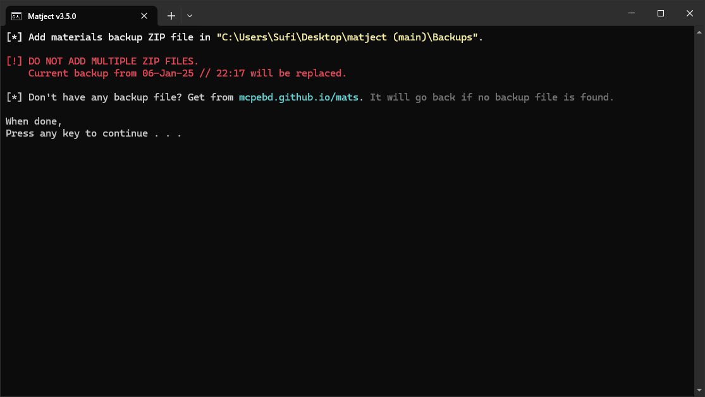
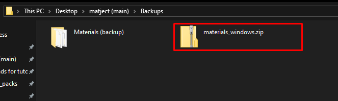
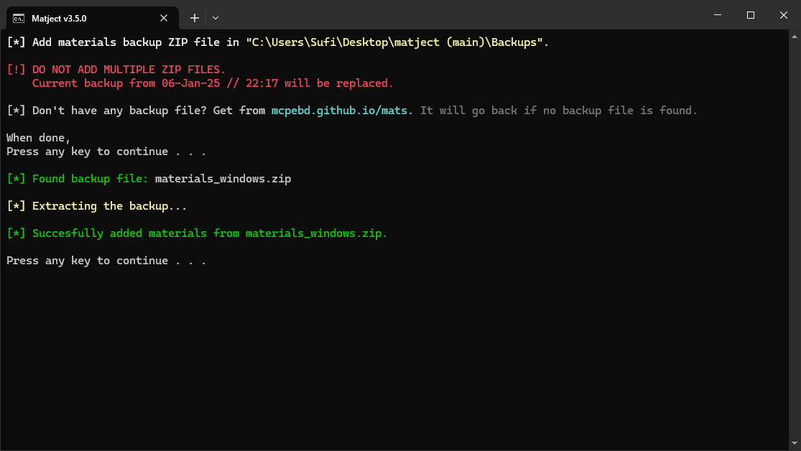
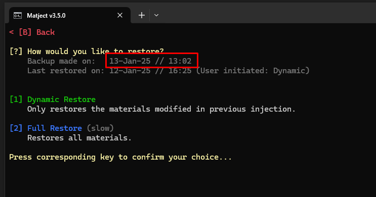

# Replace current backup with ZIP

You should only follow this guide if you don't have unmodified game files or lost the backup.  

1. Go to https://mcpebd.github.io/mats  

2. Download `materials_windows.zip` under assets (make sure to match version )  

  

  

3. Open `matject` 

4. In the main screen press **[R]** for "Restore & Others"  

  

    

5. Press **[8]** for "Replace backup with ZIP file"  

  

    

6. After confirmations it will open a file explorer window for you. Put the `materials_windows.zip` file there.  

  
  

    

7. Close the window and confirm the backup replacement.  

    

8. When done, check if "Backup made on" date is changed...  

