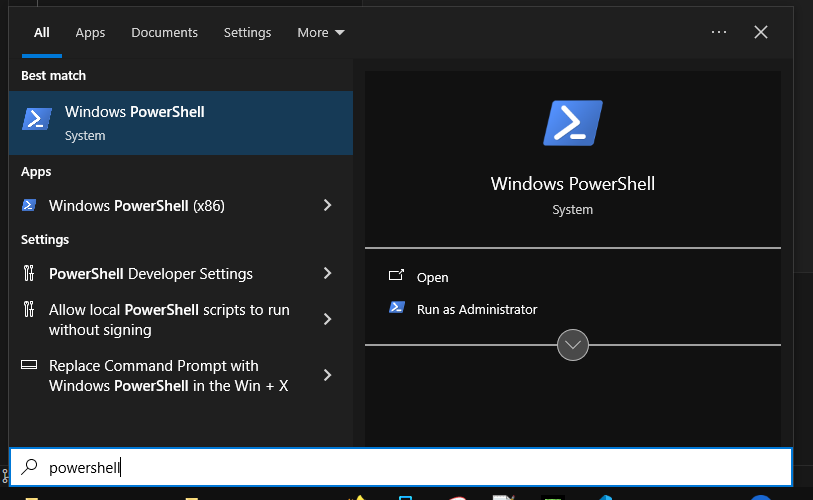

# Requirements 

### Mandatory (must have)
* Read [Important Notes](/docs/important-notes)
* [IObit Unlocker](https://www.iobit.com/en/iobit-unlocker.php)
* PowerShell (pre-installed/built-in on most Windows PCs)  

You can confirm its existence by searching `powershell` in search.    

* Basic understanding of English
* Common sense
* Enough knowledge, so you know "Command Prompt/Terminal ≠ Virus"   
[Is it safe?](/docs/is-it-safe) 

 

### Optional (not needed, used to enhance experience)
* curl¹ (check/download updates, show announcements, get other tools)
* tar¹ (extract zip files)
* git² (download update from official repo)

::: info Note
**¹** Built-in on recent Windows versions.  
Check existence of both by running `where curl` and `where tar` in Command Prompt/Terminal.  
If exists, location of it will be shown  
or it will say `INFO: Could not find files for the given pattern(s).`  

`curl` and `tar` are prioritized over built-in Windows tools to make Matject faster.  
\
² `git clone` is used to get current repo content.  
Prioritized over curl so extracting is not needed.
:::

 