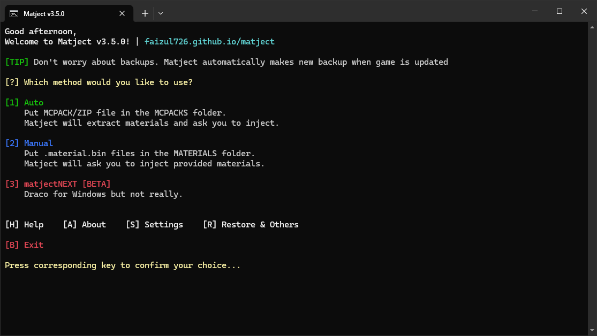
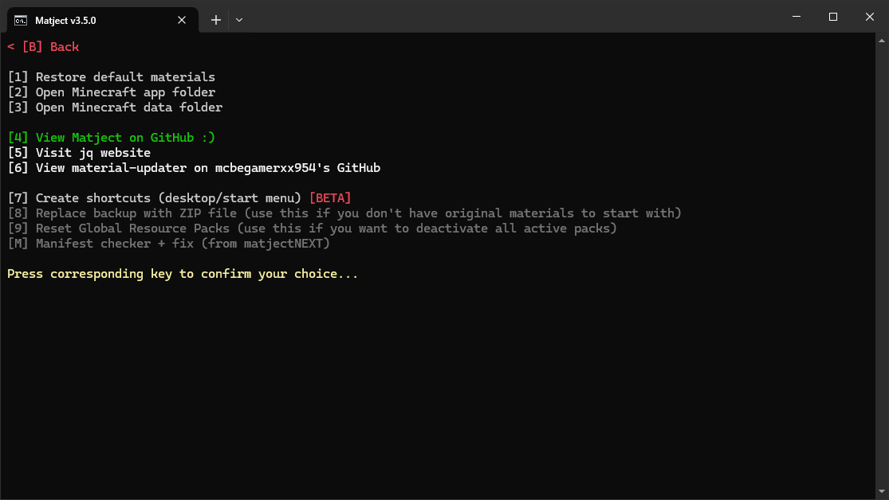
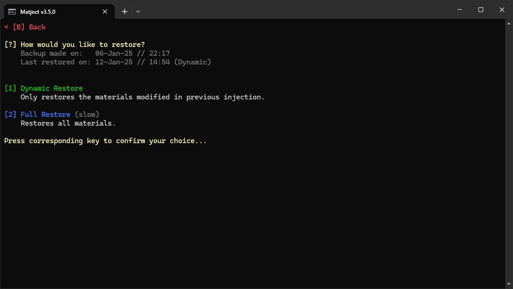
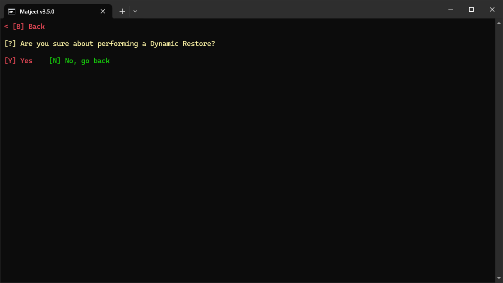
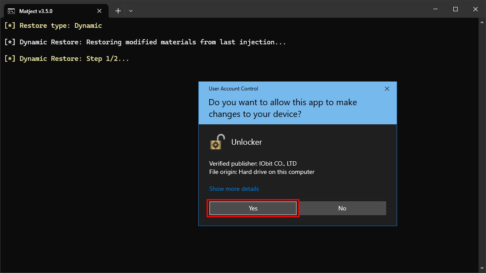

# Restoring to default 

::: info
You DON'T HAVE TO reinstall the whole game to remove shaders.  
Matject can restore to default/remove shaders whenever you want.
::: 

1. Open `matject`  

2. In the main screen, press **[R]** for "Restore & Others".  

  

  

3. Press **[1]** for "Restore default materials"  

  

4. In the restore screen... 

  

Press **[1]** for dynamic restore.  
Press **[2]** for full restore.  

Both are the same. The only difference is how the task is done.  

In simple words...  
**Dynamic Restore** is fast. It only restores the files that were modified.  
[See how dynamic restore works](/docs/what-is-dynamic-restore)

**Full Restore** is slow. It restores all files from backup.  

&nbsp;

5. Confirm restore by pressing **[Y]**  

  

6. As usual...
Accept every admin permission request.  

  

Now the custom shaders should be gone from the game.

&nbsp;

[**Restore is not working!**](restore-not-working)