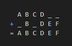

# What is Dynamic Restore?

It is one of the key features of Matject.  

Matject keeps track of modified files. When you use Matject it sees if some other files are needed to be restored. If needed it will automatically perform a dynamic restore.  

## How it works?
Let's say,  

[Shader X] modifies A, B, C, D files.  
[Shader Y] modifies B, D, E, F files.  

As you can see Y is missing A and C.  

You already have applied X using Matject. Since A and C aren't a part of Y, applying Y would look like this

This creates a mixed experience between X and Y since A and C aren't replaced with their original versions. Causing shader to not work expected.  

That's where **Dynamic Restore** comes to play.  
It sees what files are modified when you applied X.  
Restores those files (A, B, C, D) and then proceeds to inject Y (B, D, E, F) causing the result to look the same as Y.  

It may not make any sense to you if you are not familiar with `.material.bin` files. So just keep in mind that, 

### Dynamic Restore makes sure that you don't have any files from older shaders.